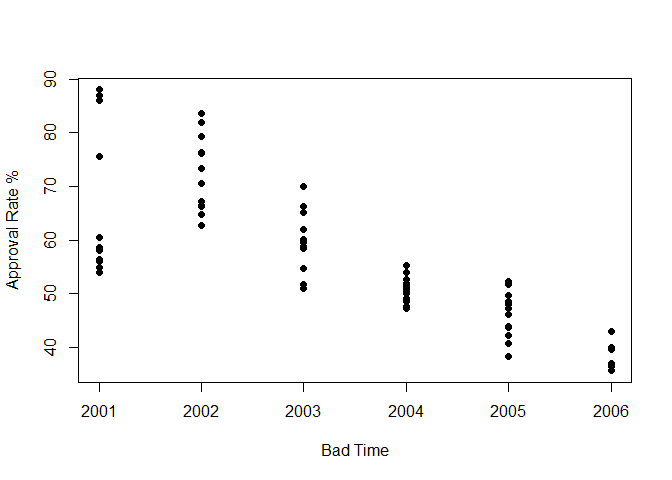
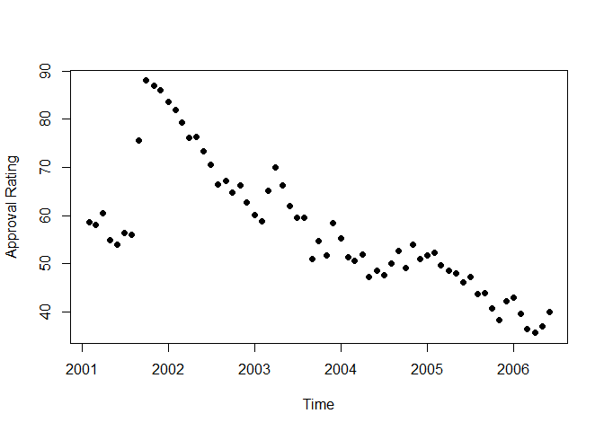
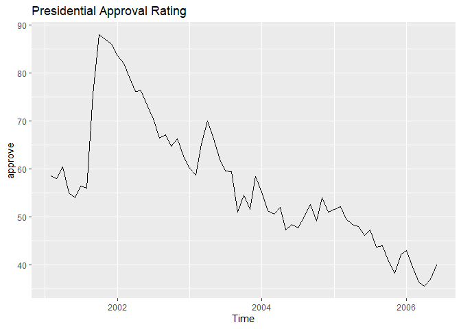

Week 2: Introduction to R part 2:
=================================

Hello everybody! Welcome to week 2!

Lesson 0: Quick review from last time
-------------------------------------

We learned last time about:

-   Objects in R
-   Functions in R
-   Math calculations in R
-   Object types in R
-   How to load packages
-   Dataframes
-   Basic Plots
-   Regression Models

This time, we will introduce the tidyverse, and show you how to load
your own data into the R workspace.

Lab outline:

-   Lesson 1: Directories
-   Lesson 2: Loading Data
-   Lesson 3: Data Manipulation
-   Lesson 4: Introduction to ggplot2

Lesson 1: Directories
---------------------

Before we learn to read data into R, it would be helpful to know how to
tell R where it is. This is important because later in the class we need
to load files from our local machine. Eventually, we want to start using
our own data instead of data contained in a package.

*Note: Windows and R can both use directory separator `/`. Windows can
also use `\\` (must be double).*

-   To find your current directory: `getwd()`. “wd” stands for working
    directory.

``` r
getwd()
```

-   To change directories: `setwd()`

``` r
setwd("..")
getwd()
```

-   To show files in the current directory: `dir()`

``` r
dir()
```

-   Notice that directories are characters (surrounded by `""`).
-   RStudio will help you complete file paths when you hit tab while
    typing in the console.
-   You can save an object with the directory location and then return
    to that directory using `setwd()`.

Example:

``` r
my_dir <- "C:/Users/Ajdic/OneDrive - University Of Oregon/GE/EC 421 - Q12020/Lab_02"
setwd(my_dir)
```

Lesson 2: Loading data
----------------------

R can read in data from just about any source/format. Today we’re going
to cover reading data saved in CSVs (comma-separated variables).

First, we’ll load the `tidyverse` package, which will actually load
several packages (we want `readr`). The `base` (basic) installation of R
already has a function for reading CSVs, but the function in `tidyverse`
(`readr`) is a bit nicer.

Recall our workflow packages from last time:

``` r
library(pacman)
p_load(tidyverse)
```

You can get to the help files in R/RStudio using `?`. Let’s check out
the help file for `read_csv`.

``` r
?read_csv
```

    ## starting httpd help server ... done

Next we are going to work with a `.csv` to practice. So let’s go get one
online!

The data we are going to work with in this lab with be a publically
available data set that tracks monthly U.S. Presidential approval
ratings from 2001 to 2006. We can find, download, and load it into our
meomory with the following procedure:

-   Step 1: Find the `.csv` from the following link -
    <a href="https://www.stat.auckland.ac.nz/~wild/data/Rdatasets/" class="uri">https://www.stat.auckland.ac.nz/~wild/data/Rdatasets/</a>
    -   It is titled ‘approval’ - ‘U.S. Presidential Approval Data’, use
        Ctrl + F or Command + F to search the website
-   Step 2: Download the file to a folder on your computer, note the
    directory.
    -   You can find the file’s filepath by either (windows) right
        clicking on the file and looking in **properties**, under
        location
    -   Or, (Mac) right click on the file, hold down alt and select the
        **copy as filepath** option

*One of the most important habits to have when coding is to be extremely
organized. Think hard about where you save things, it will save you time
in the future if you are smart about it.*

-   Step 3: Navigate R to the folder loacation, using the
    `setwd(my_dir)` command, setting my\_dir to the filepath

-   Step 4: Read the data into R, using `read_csv("./approval.csv")`

``` r
read_csv("./data/approval.csv") %>% head()
```

    ## Parsed with column specification:
    ## cols(
    ##   month = col_double(),
    ##   year = col_double(),
    ##   approve = col_double(),
    ##   disapprove = col_double(),
    ##   unsure = col_double(),
    ##   sept.oct.2001 = col_double(),
    ##   iraq.war = col_double(),
    ##   avg.price = col_double()
    ## )

    ## # A tibble: 6 x 8
    ##   month  year approve disapprove unsure sept.oct.2001 iraq.war avg.price
    ##   <dbl> <dbl>   <dbl>      <dbl>  <dbl>         <dbl>    <dbl>     <dbl>
    ## 1     2  2001    58.7       23.7   17.7             0        0      145.
    ## 2     3  2001    58         26.7   15.3             0        0      141.
    ## 3     4  2001    60.5       29.5   10               0        0      155.
    ## 4     5  2001    55         33.3   11.7             0        0      170.
    ## 5     6  2001    54         34     12               0        0      162.
    ## 6     7  2001    56.5       34      9.5             0        0      142.

*Recall from last time - using `head()` is a good way to get a visual
representation of the data set when first *

-   Notice that we read the data, but it just printed to screen. We want
    to assign the data to an object (give it a name).
    `pres_df <- read_csv("presidents.csv")`

``` r
pres_df <- read_csv("./data/approval.csv")
```

    ## Parsed with column specification:
    ## cols(
    ##   month = col_double(),
    ##   year = col_double(),
    ##   approve = col_double(),
    ##   disapprove = col_double(),
    ##   unsure = col_double(),
    ##   sept.oct.2001 = col_double(),
    ##   iraq.war = col_double(),
    ##   avg.price = col_double()
    ## )

Additionally, `glimpse()` and `summary()` are two of my favorite
functions when working with a new data set

``` r
glimpse(pres_df)
```

    ## Rows: 65
    ## Columns: 8
    ## $ month         <dbl> 2, 3, 4, 5, 6, 7, 8, 9, 10, 11, 12, 1, 2, 3, 4, 5, 6,...
    ## $ year          <dbl> 2001, 2001, 2001, 2001, 2001, 2001, 2001, 2001, 2001,...
    ## $ approve       <dbl> 58.67, 58.00, 60.50, 55.00, 54.00, 56.50, 56.00, 75.6...
    ## $ disapprove    <dbl> 23.67, 26.67, 29.50, 33.33, 34.00, 34.00, 35.00, 18.3...
    ## $ unsure        <dbl> 17.67, 15.33, 10.00, 11.67, 12.00, 9.50, 9.00, 6.00, ...
    ## $ sept.oct.2001 <dbl> 0, 0, 0, 0, 0, 0, 0, 1, 1, 0, 0, 0, 0, 0, 0, 0, 0, 0,...
    ## $ iraq.war      <dbl> 0, 0, 0, 0, 0, 0, 0, 0, 0, 0, 0, 0, 0, 0, 0, 0, 0, 0,...
    ## $ avg.price     <dbl> 144.975, 140.925, 155.160, 170.175, 161.625, 142.060,...

``` r
pres_df %>% summary()
```

    ##      month             year         approve        disapprove   
    ##  Min.   : 1.000   Min.   :2001   Min.   :35.67   Min.   : 8.67  
    ##  1st Qu.: 3.000   1st Qu.:2002   1st Qu.:48.50   1st Qu.:28.20  
    ##  Median : 6.000   Median :2003   Median :54.67   Median :41.25  
    ##  Mean   : 6.308   Mean   :2003   Mean   :57.17   Mean   :37.85  
    ##  3rd Qu.: 9.000   3rd Qu.:2005   3rd Qu.:65.20   3rd Qu.:47.75  
    ##  Max.   :12.000   Max.   :2006   Max.   :88.00   Max.   :60.67  
    ##      unsure       sept.oct.2001        iraq.war         avg.price    
    ##  Min.   : 2.330   Min.   :0.00000   Min.   :0.00000   Min.   :108.6  
    ##  1st Qu.: 3.500   1st Qu.:0.00000   1st Qu.:0.00000   1st Qu.:142.1  
    ##  Median : 4.000   Median :0.00000   Median :0.00000   Median :162.0  
    ##  Mean   : 4.985   Mean   :0.03077   Mean   :0.04615   Mean   :177.6  
    ##  3rd Qu.: 5.000   3rd Qu.:0.00000   3rd Qu.:0.00000   3rd Qu.:199.9  
    ##  Max.   :17.670   Max.   :1.00000   Max.   :1.00000   Max.   :290.7

Most of the varaibles are self explanatory. However, a few are not super
clear

-   ‘sept.oct.2001’: A binary variable for 9-11-2001 (why would this be
    included??)
-   ‘iraq.war’: A binary variable for the beginning of the Iraq war
-   ‘avg.price’: Average price of a barrel of oil

**Question: What does the following code do? Try to figure this out
before running**

``` r
head(table(pres_df$year > 2003, pres_df$approve > 50))
```

    ##        
    ##         FALSE TRUE
    ##   FALSE     0   35
    ##   TRUE     21    9

**What about this code?**

``` r
pres_df %>% filter(year > 2003, approve > 50)
```

    ## # A tibble: 9 x 8
    ##   month  year approve disapprove unsure sept.oct.2001 iraq.war avg.price
    ##   <dbl> <dbl>   <dbl>      <dbl>  <dbl>         <dbl>    <dbl>     <dbl>
    ## 1     1  2004    55.2       41.2   3.5              0        0      157.
    ## 2     2  2004    51.3       45.3   3.33             0        0      165.
    ## 3     3  2004    50.7       46.3   3                0        0      174.
    ## 4     4  2004    52         45     3                0        0      180.
    ## 5     9  2004    52.7       45     2.33             0        0      187.
    ## 6    11  2004    54         43     3                0        0      198.
    ## 7    12  2004    51         45     4                0        0      184.
    ## 8     1  2005    51.7       44.7   3.67             0        0      183.
    ## 9     2  2005    52.2       44.5   3.25             0        0      191

One other way to quickly summarize a new dataframe/variable is to create
a visual. The `plot()` function is a simple, easy to use function to
make quick graphs

``` r
plot(pres_df$year, pres_df$approve, pch = 19, xlab = "Bad Time", ylab = "Approval Rate %")
```



But wait, this looks weird. We are only plotting over years, not months
and We have more information in the ‘month’ variable. How can we make
this plot more informative?

Let’s make our time variables flexible. We’ll do this with the lubridate
package.

``` r
p_load(lubridate)
```

We have two time/date related variables: ‘year’ and ‘month’. But what if
we wanted to have one time/date variable that includes both the year and
month varaible? Let’s just make one!

We can do this using another dplyr function: `mutate()`

*Mutate is your best friend*

What is mutate? Mutate is a function that writes new variables.

``` r
#?mutate()
```

Here are a few examples:

``` r
pres_df %>% mutate(eleven = 11) #creates a variable for each observation with the value of 11
```

    ## # A tibble: 65 x 9
    ##    month  year approve disapprove unsure sept.oct.2001 iraq.war avg.price eleven
    ##    <dbl> <dbl>   <dbl>      <dbl>  <dbl>         <dbl>    <dbl>     <dbl>  <dbl>
    ##  1     2  2001    58.7      23.7   17.7              0        0      145.     11
    ##  2     3  2001    58        26.7   15.3              0        0      141.     11
    ##  3     4  2001    60.5      29.5   10                0        0      155.     11
    ##  4     5  2001    55        33.3   11.7              0        0      170.     11
    ##  5     6  2001    54        34     12                0        0      162.     11
    ##  6     7  2001    56.5      34      9.5              0        0      142.     11
    ##  7     8  2001    56        35      9                0        0      142.     11
    ##  8     9  2001    75.7      18.3    6                1        0      152.     11
    ##  9    10  2001    88         9      3                1        0      132.     11
    ## 10    11  2001    87         8.67   4.33             0        0      117.     11
    ## # ... with 55 more rows

``` r
pres_df %>% mutate(avg.price_levels = (avg.price/max(avg.price))) # This creates a new varaible for 'avg.price' but normalizes the maximum to 1
```

    ## # A tibble: 65 x 9
    ##    month  year approve disapprove unsure sept.oct.2001 iraq.war avg.price
    ##    <dbl> <dbl>   <dbl>      <dbl>  <dbl>         <dbl>    <dbl>     <dbl>
    ##  1     2  2001    58.7      23.7   17.7              0        0      145.
    ##  2     3  2001    58        26.7   15.3              0        0      141.
    ##  3     4  2001    60.5      29.5   10                0        0      155.
    ##  4     5  2001    55        33.3   11.7              0        0      170.
    ##  5     6  2001    54        34     12                0        0      162.
    ##  6     7  2001    56.5      34      9.5              0        0      142.
    ##  7     8  2001    56        35      9                0        0      142.
    ##  8     9  2001    75.7      18.3    6                1        0      152.
    ##  9    10  2001    88         9      3                1        0      132.
    ## 10    11  2001    87         8.67   4.33             0        0      117.
    ## # ... with 55 more rows, and 1 more variable: avg.price_levels <dbl>

Notice, the variables are not saved to your dataframe.

``` r
head(pres_df)
```

    ## # A tibble: 6 x 8
    ##   month  year approve disapprove unsure sept.oct.2001 iraq.war avg.price
    ##   <dbl> <dbl>   <dbl>      <dbl>  <dbl>         <dbl>    <dbl>     <dbl>
    ## 1     2  2001    58.7       23.7   17.7             0        0      145.
    ## 2     3  2001    58         26.7   15.3             0        0      141.
    ## 3     4  2001    60.5       29.5   10               0        0      155.
    ## 4     5  2001    55         33.3   11.7             0        0      170.
    ## 5     6  2001    54         34     12               0        0      162.
    ## 6     7  2001    56.5       34      9.5             0        0      142.

In order to change you dataframe, you must assign the mutated dataframe
to an object or your previous dataframe object. For example:

``` r
pres_df_example <- pres_df %>% mutate(eleven = 11)
head(pres_df_example)
```

    ## # A tibble: 6 x 9
    ##   month  year approve disapprove unsure sept.oct.2001 iraq.war avg.price eleven
    ##   <dbl> <dbl>   <dbl>      <dbl>  <dbl>         <dbl>    <dbl>     <dbl>  <dbl>
    ## 1     2  2001    58.7       23.7   17.7             0        0      145.     11
    ## 2     3  2001    58         26.7   15.3             0        0      141.     11
    ## 3     4  2001    60.5       29.5   10               0        0      155.     11
    ## 4     5  2001    55         33.3   11.7             0        0      170.     11
    ## 5     6  2001    54         34     12               0        0      162.     11
    ## 6     7  2001    56.5       34      9.5             0        0      142.     11

Now lets try to use ‘year’ and ‘month’ to make a ‘year\_month’ varaible
using the lubridate package

``` r
pres_df <- pres_df %>% mutate(year_month = make_datetime(year, month))
head(pres_df)
```

    ## # A tibble: 6 x 9
    ##   month  year approve disapprove unsure sept.oct.2001 iraq.war avg.price
    ##   <dbl> <dbl>   <dbl>      <dbl>  <dbl>         <dbl>    <dbl>     <dbl>
    ## 1     2  2001    58.7       23.7   17.7             0        0      145.
    ## 2     3  2001    58         26.7   15.3             0        0      141.
    ## 3     4  2001    60.5       29.5   10               0        0      155.
    ## 4     5  2001    55         33.3   11.7             0        0      170.
    ## 5     6  2001    54         34     12               0        0      162.
    ## 6     7  2001    56.5       34      9.5             0        0      142.
    ## # ... with 1 more variable: year_month <dttm>

``` r
tail(pres_df)
```

    ## # A tibble: 6 x 9
    ##   month  year approve disapprove unsure sept.oct.2001 iraq.war avg.price
    ##   <dbl> <dbl>   <dbl>      <dbl>  <dbl>         <dbl>    <dbl>     <dbl>
    ## 1     1  2006    43         53.7   3.67             0        0      232.
    ## 2     2  2006    39.7       57     3.33             0        0      228 
    ## 3     3  2006    36.5       59.5   4.5              0        0      242.
    ## 4     4  2006    35.7       60.7   3.67             0        0      274.
    ## 5     5  2006    37         57.7   5                0        0      291.
    ## 6     6  2006    40         55     5                0        0      288.
    ## # ... with 1 more variable: year_month <dttm>

Now, using this new variable, we can create informative plots over time.

``` r
plot(pres_df$year_month, pres_df$approve, pch = 19, xlab = "Time", ylab = "Approval Rating")
```



There, this looks much better.

Lesson 3: Data manipulation
---------------------------

You will often need to do some data work before you’re ready to actually
implement econometric/statistical modeling. This data work generally
includes adding new variables, dropping unwanted observations, and
merging datasets.

In R, there are many ways to do the same task. For the most part, we’re
going to try to stick to the functions contained in the `tidyverse`.

The three big `tidyverse` functions that we will go over today are:

-   `mutate()`
-   `select()`
-   `filter()`

We have already used `mutate()` above in the previous lesson but let’s
go over it again because it is very important

### Creating (mutating) new variables

`dplyr` also makes it easy to create add new variables using `mutate`.
Mutate takes as arguments a dataframe and then some function to use to
create a new column. Mutate will then output an **entirely new
dataframe** with your new column added on.

Let’s work through a few examples:

A column of ones:

``` r
pres_df %>% mutate(ones = 1)
```

    ## # A tibble: 65 x 10
    ##    month  year approve disapprove unsure sept.oct.2001 iraq.war avg.price
    ##    <dbl> <dbl>   <dbl>      <dbl>  <dbl>         <dbl>    <dbl>     <dbl>
    ##  1     2  2001    58.7      23.7   17.7              0        0      145.
    ##  2     3  2001    58        26.7   15.3              0        0      141.
    ##  3     4  2001    60.5      29.5   10                0        0      155.
    ##  4     5  2001    55        33.3   11.7              0        0      170.
    ##  5     6  2001    54        34     12                0        0      162.
    ##  6     7  2001    56.5      34      9.5              0        0      142.
    ##  7     8  2001    56        35      9                0        0      142.
    ##  8     9  2001    75.7      18.3    6                1        0      152.
    ##  9    10  2001    88         9      3                1        0      132.
    ## 10    11  2001    87         8.67   4.33             0        0      117.
    ## # ... with 55 more rows, and 2 more variables: year_month <dttm>, ones <dbl>

If we wanted to keep this variable to use later, we would need to
re-assign the output of `mutate` to `pres_df` (or a brand new dataframe)
to save it.

Also note that we can give `mutate()` a single value and it will fill in
the whole column (variable) with that value. This can be handy.

We can make a time trend as well. I know that the data is 65
observations long, but let’s just say I didn’t know that. Do you
remember how we could figure it out?

``` r
nrow(pres_df)
```

    ## [1] 65

Now, we can make a timetrend using this command directly

``` r
#This creates a time trend
pres_df <- mutate(pres_df, time_trend = 1:65)
#This command is equivalent to
pres_df <- mutate(pres_df, time_trend = 1:nrow(pres_df))
#This command, however, lets us change the number of observations in our dataframe without changing our code for the time trend.
```

We can also easily create dummy variables. Let’s create a dummy variable
for “post 9/11” (observation number 8 in the time trend):

``` r
pres_df <- mutate(pres_df, post_911 = time_trend >= 8)
```

However, what kind of variable is ‘post\_911’? Let’s look.

``` r
class(pres_df$post_911)
```

    ## [1] "logical"

Recall from last lecture that this means it is either equal to `TRUE`,
`FALSE` or `NA`. We might want to have a more traditional, 0,1 dummy
variable. We can do this with the following command:

``` r
#Use as.integer to cast a true-false value to 0,1.
pres_df <- mutate(pres_df, post_911 = as.integer(time_trend >= 8))
pres_df$post_911
```

    ##  [1] 0 0 0 0 0 0 0 1 1 1 1 1 1 1 1 1 1 1 1 1 1 1 1 1 1 1 1 1 1 1 1 1 1 1 1 1 1 1
    ## [39] 1 1 1 1 1 1 1 1 1 1 1 1 1 1 1 1 1 1 1 1 1 1 1 1 1 1 1

If we want to convert it back, we can simply do so using the
`as.logical` command

``` r
pres_df$post_911 <- as.logical(pres_df$post_911)
```

Let’s create another dummy variable for “post beginning of Iraq war”
(starts with observation number 26 in the time trend):

``` r
pres_df <- mutate(pres_df, post_iraq = time_trend >= 26)
#now, our dataframe pres_df has a new column called "post_iraq"
pres_df$post_iraq
```

    ##  [1] FALSE FALSE FALSE FALSE FALSE FALSE FALSE FALSE FALSE FALSE FALSE FALSE
    ## [13] FALSE FALSE FALSE FALSE FALSE FALSE FALSE FALSE FALSE FALSE FALSE FALSE
    ## [25] FALSE  TRUE  TRUE  TRUE  TRUE  TRUE  TRUE  TRUE  TRUE  TRUE  TRUE  TRUE
    ## [37]  TRUE  TRUE  TRUE  TRUE  TRUE  TRUE  TRUE  TRUE  TRUE  TRUE  TRUE  TRUE
    ## [49]  TRUE  TRUE  TRUE  TRUE  TRUE  TRUE  TRUE  TRUE  TRUE  TRUE  TRUE  TRUE
    ## [61]  TRUE  TRUE  TRUE  TRUE  TRUE

### Selecting columns

Last time, we covered two different methods of selecting a dataframe’s
columns. The first was by column name

``` r
head(pres_df$year)
```

    ## [1] 2001 2001 2001 2001 2001 2001

The second was by index number

``` r
#Year is the third column in our pres_df dataframe
head(pres_df[,3])
```

    ## # A tibble: 6 x 1
    ##   approve
    ##     <dbl>
    ## 1    58.7
    ## 2    58  
    ## 3    60.5
    ## 4    55  
    ## 5    54  
    ## 6    56.5

The `dplyr` package however (part of the `tidyverse`) offers a nice
alternative (plus a lot more functionality).

Let’s start with the `select` function. We can grab a column with its
name using select

``` r
#Select(dataframe_name, column_name)
pres_df %>% select(year) %>% head()
```

    ## # A tibble: 6 x 1
    ##    year
    ##   <dbl>
    ## 1  2001
    ## 2  2001
    ## 3  2001
    ## 4  2001
    ## 5  2001
    ## 6  2001

Alternatively, we can use the pipe operator `%>%`. This takes the
dataframe on the left side and passes it to the right. This lets us pass
one command to another.

Let’s filter our dataframe down to only the `year` and `month`
variables, and then pass that dataframe to another filter command that
will select only the `month` variable.

``` r
#first, select month and year, then, select month
pres_df %>%
  select(month) %>%
  head()
```

    ## # A tibble: 6 x 1
    ##   month
    ##   <dbl>
    ## 1     2
    ## 2     3
    ## 3     4
    ## 4     5
    ## 5     6
    ## 6     7

### Filtering observations

We already know of some ways to do this, either by mentioning the name
of a variable, or by calling a row/column by index.

Grab some of the observations from a data frame: - Grab the first 4
rows: `pres_df[1:4,]` - 6th, 8th, 12th, 13rd rows:
`pres_df[c(6, 8, 12, 13),]`

``` r
head(pres_df[1:4,])
```

    ## # A tibble: 4 x 12
    ##   month  year approve disapprove unsure sept.oct.2001 iraq.war avg.price
    ##   <dbl> <dbl>   <dbl>      <dbl>  <dbl>         <dbl>    <dbl>     <dbl>
    ## 1     2  2001    58.7       23.7   17.7             0        0      145.
    ## 2     3  2001    58         26.7   15.3             0        0      141.
    ## 3     4  2001    60.5       29.5   10               0        0      155.
    ## 4     5  2001    55         33.3   11.7             0        0      170.
    ## # ... with 4 more variables: year_month <dttm>, time_trend <int>,
    ## #   post_911 <lgl>, post_iraq <lgl>

``` r
head(pres_df[c(6, 8, 12, 13),])
```

    ## # A tibble: 4 x 12
    ##   month  year approve disapprove unsure sept.oct.2001 iraq.war avg.price
    ##   <dbl> <dbl>   <dbl>      <dbl>  <dbl>         <dbl>    <dbl>     <dbl>
    ## 1     7  2001    56.5       34     9.5              0        0      142.
    ## 2     9  2001    75.7       18.3   6                1        0      152.
    ## 3     1  2002    83.7       12.7   3.67             0        0      111.
    ## 4     2  2002    82         14     4                0        0      111.
    ## # ... with 4 more variables: year_month <dttm>, time_trend <int>,
    ## #   post_911 <lgl>, post_iraq <lgl>

`dplyr` allows us to get a bit more sophisticated: We can now filter
data using a single variable, using the `filter()` command

Only observations in 2001:

``` r
filter(pres_df, year == 2001)
```

    ## # A tibble: 11 x 12
    ##    month  year approve disapprove unsure sept.oct.2001 iraq.war avg.price
    ##    <dbl> <dbl>   <dbl>      <dbl>  <dbl>         <dbl>    <dbl>     <dbl>
    ##  1     2  2001    58.7      23.7   17.7              0        0      145.
    ##  2     3  2001    58        26.7   15.3              0        0      141.
    ##  3     4  2001    60.5      29.5   10                0        0      155.
    ##  4     5  2001    55        33.3   11.7              0        0      170.
    ##  5     6  2001    54        34     12                0        0      162.
    ##  6     7  2001    56.5      34      9.5              0        0      142.
    ##  7     8  2001    56        35      9                0        0      142.
    ##  8     9  2001    75.7      18.3    6                1        0      152.
    ##  9    10  2001    88         9      3                1        0      132.
    ## 10    11  2001    87         8.67   4.33             0        0      117.
    ## 11    12  2001    86        10.5    3.5              0        0      109.
    ## # ... with 4 more variables: year_month <dttm>, time_trend <int>,
    ## #   post_911 <lgl>, post_iraq <lgl>

Only observations in 2001 OR 2002:

``` r
tail(filter(pres_df, year %in% c(2001, 2002)))
```

    ## # A tibble: 6 x 12
    ##   month  year approve disapprove unsure sept.oct.2001 iraq.war avg.price
    ##   <dbl> <dbl>   <dbl>      <dbl>  <dbl>         <dbl>    <dbl>     <dbl>
    ## 1     7  2002    70.5       23.5   6                0        0      140.
    ## 2     8  2002    66.5       27     6.5              0        0      140.
    ## 3     9  2002    67.2       28.2   4.6              0        0      140.
    ## 4    10  2002    64.8       29     6.25             0        0      145.
    ## 5    11  2002    66.3       27     6.67             0        0      142.
    ## 6    12  2002    62.8       31.5   5.75             0        0      139.
    ## # ... with 4 more variables: year_month <dttm>, time_trend <int>,
    ## #   post_911 <lgl>, post_iraq <lgl>

``` r
# Using pipes

pres_df %>%
  filter(year %in% c(2001, 2002)) %>%
  tail()
```

    ## # A tibble: 6 x 12
    ##   month  year approve disapprove unsure sept.oct.2001 iraq.war avg.price
    ##   <dbl> <dbl>   <dbl>      <dbl>  <dbl>         <dbl>    <dbl>     <dbl>
    ## 1     7  2002    70.5       23.5   6                0        0      140.
    ## 2     8  2002    66.5       27     6.5              0        0      140.
    ## 3     9  2002    67.2       28.2   4.6              0        0      140.
    ## 4    10  2002    64.8       29     6.25             0        0      145.
    ## 5    11  2002    66.3       27     6.67             0        0      142.
    ## 6    12  2002    62.8       31.5   5.75             0        0      139.
    ## # ... with 4 more variables: year_month <dttm>, time_trend <int>,
    ## #   post_911 <lgl>, post_iraq <lgl>

Only observations between 2001 and 2003:

``` r
pres_df %>% filter(between(year, 2001, 2003)) %>% head()
```

    ## # A tibble: 6 x 12
    ##   month  year approve disapprove unsure sept.oct.2001 iraq.war avg.price
    ##   <dbl> <dbl>   <dbl>      <dbl>  <dbl>         <dbl>    <dbl>     <dbl>
    ## 1     2  2001    58.7       23.7   17.7             0        0      145.
    ## 2     3  2001    58         26.7   15.3             0        0      141.
    ## 3     4  2001    60.5       29.5   10               0        0      155.
    ## 4     5  2001    55         33.3   11.7             0        0      170.
    ## 5     6  2001    54         34     12               0        0      162.
    ## 6     7  2001    56.5       34      9.5             0        0      142.
    ## # ... with 4 more variables: year_month <dttm>, time_trend <int>,
    ## #   post_911 <lgl>, post_iraq <lgl>

Filter observations using multiple variables `sept.oct.2001` is `1` OR
`iraq.war` is `1`. Recall our ‘or’ symbol, \|

``` r
filter(pres_df, sept.oct.2001 == 1 | iraq.war == 1)
```

    ## # A tibble: 5 x 12
    ##   month  year approve disapprove unsure sept.oct.2001 iraq.war avg.price
    ##   <dbl> <dbl>   <dbl>      <dbl>  <dbl>         <dbl>    <dbl>     <dbl>
    ## 1     9  2001    75.7       18.3   6                1        0      152.
    ## 2    10  2001    88          9     3                1        0      132.
    ## 3     3  2003    65.2       30.6   4.2              0        1      169.
    ## 4     4  2003    70         25.8   4.25             0        1      159.
    ## 5     5  2003    66.3       30     3.67             0        1      150.
    ## # ... with 4 more variables: year_month <dttm>, time_trend <int>,
    ## #   post_911 <lgl>, post_iraq <lgl>

Lesson 04: Introduction to ggplot2
----------------------------------

Finally lets quickly go over the most powerful visualization tool for
this class: `ggplot()`. This function deserves a lesson by itself. You
can create a lot of pretty graphs and animations using ggplot and we
will just scratch the surface today.

To install the `ggplot2` package run the following code in your console:
`install.packages('ggplot2')`

``` r
p_load(ggplot2)
```

Now lets recreate the graph from the earlier lesson using ggplot

``` r
ggplot(pres_df, aes(x = year_month, y = approve)) +
  geom_line() +
  ggtitle('Presidential Approval Rating') +
  xlab('Time')
```


