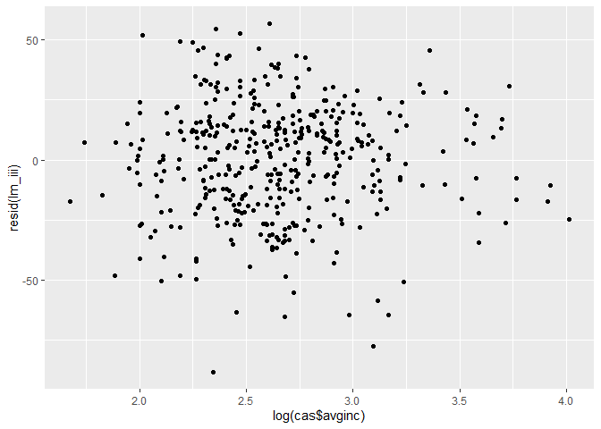
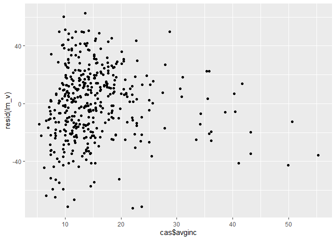

# Homework Review

Hi guys! Welcome to week three. This week, we're going to review some materials on homework 1 that were quite tricky. In particular regarding number 3, how to derive z-stat/t-stat and how to interpret the interaction term in a regression result. 

We're going to quickly go ahead and do the following; 
 - Installing and loading new packages 
 - Learn a new tidyverse command: 'group_by()'
 - Practice running regressions (with a twist)
 - Do some analysis 

## Basic Setup

First, to setup for today's lab we will be using the same data from problem set 1

  

```r
# Loading packages
library(pacman)

# If you have not already, install the following package: "magrittr"
# install.packages("magrittr", dependencies = TRUE)

# Load the necessary packages
p_load(tidyverse, broom, magrittr)

# Set working directory
setwd('C:/Users/Ajdic/OneDrive - University Of Oregon/GE/EC 421 - Q12020/lab_03')

# Load our data 
my_path = "./data/ps01_data.csv"
df <- read_csv(my_path)
```

```
## 
## -- Column specification --------------------------------------------------------
## cols(
##   first_name = col_character(),
##   sex = col_character(),
##   i_callback = col_double(),
##   n_jobs = col_double(),
##   n_expr = col_double(),
##   i_military = col_double(),
##   i_computer = col_double(),
##   i_female = col_double(),
##   i_male = col_double(),
##   race = col_character(),
##   i_black = col_double(),
##   i_white = col_double()
## )
```

## Group_by()

Often, we want stats on subsets of the data. the 'group_by()' function allows us to subset our dataframes into smaller samples. This gives us more flexibility in our analysis.

For example:

Let's say we want to look at mean callback rates for four samples: white males, white females, black males, and black females. One way we can do this is by using the filter command


```r
df %>% filter(i_female == 0, race == 'w') %>% summarize(mean(i_callback))
```

```
## # A tibble: 1 x 1
##   `mean(i_callback)`
##                <dbl>
## 1             0.0889
```

```r
df %>% filter(i_female == 1, race == 'w') %>% summarize(mean(i_callback))
```

```
## # A tibble: 1 x 1
##   `mean(i_callback)`
##                <dbl>
## 1             0.0991
```

```r
df %>% filter(i_female == 0, race == 'b') %>% summarize(mean(i_callback))
```

```
## # A tibble: 1 x 1
##   `mean(i_callback)`
##                <dbl>
## 1             0.0583
```

```r
df %>% filter(i_female == 1, race == 'b') %>% summarize(mean(i_callback))
```

```
## # A tibble: 1 x 1
##   `mean(i_callback)`
##                <dbl>
## 1             0.0663
```

However, there is an easier way to do this using group_by(). It will be a much more convenient function than filter. You will see why below


```r
df %>% group_by(race, i_female) %>% summarize(mean(i_callback))
```

```
## `summarise()` regrouping output by 'race' (override with `.groups` argument)
```

```
## # A tibble: 4 x 3
## # Groups:   race [2]
##   race  i_female `mean(i_callback)`
##   <chr>    <dbl>              <dbl>
## 1 b            0             0.0583
## 2 b            1             0.0663
## 3 w            0             0.0889
## 4 w            1             0.0991
```

How neat. We just found what we were looking for using one line of code. Imagine how much simpler group_by() will make some more complex tasks compared to just filter() alone. 

*Note: R doesn't care about vertical space.*


```r
female_stats <- df %>%
  group_by(i_female, race) %>%
  summarize(
    total_callback= sum(i_callback),
    callback_mean= mean(i_callback),
    callback_sd = sd(i_callback)
  )
```

```
## `summarise()` regrouping output by 'i_female' (override with `.groups` argument)
```

```r
female_stats
```

```
## # A tibble: 4 x 5
## # Groups:   i_female [2]
##   i_female race  total_callback callback_mean callback_sd
##      <dbl> <chr>          <dbl>         <dbl>       <dbl>
## 1        0 b                 32        0.0583       0.235
## 2        0 w                 51        0.0889       0.285
## 3        1 b                125        0.0663       0.249
## 4        1 w                184        0.0991       0.299
```

Now, we have a NEW tibble, with some information on our two groups. Handy right? 
What does the 'mean' column mean in this context? Think about what we've been doing so far.


Another way to do the same thing is to subset based on sex, using the `subset()` command.


```r
#this will create two dataframes, one where there are only males, and one with only females
m <- subset(df, sex=="m")
f <- subset(df, sex=="f")
```

MID LAB EXCERCISE BREAKDOWN!!!!

How would you verify that these methods are the same? Try to do this on your own. I'll put a solution below on the lab notes.


```r
#no peaking! If you do peak, try to guess what each of these lines is actually doing
mean(f$i_callback)
```

```
## [1] 0.08259824
```

```r
sd(f$i_callback)
```

```
## [1] 0.2753108
```

```r
nrow(f[f$i_callback == 1,])
```

```
## [1] 309
```

## Group Differences
Now let's conduct a statistical test for the difference in the two groups' average callback rates. What are our hypotheses?

H0: The difference is zero. H1: The difference is not zero
One way to do this (by hand) is to calculate all of the means and SD and then plug them into a t-test. First, we need the standard deviations and the number of each group:


```r
#counting the number of black/white observations
num_b <- df %>% filter(race == 'b') %>% nrow()
num_w <- df %>% filter(race == 'w') %>% nrow()

num_b
```

```
## [1] 2433
```

```r
num_w
```

```
## [1] 2431
```

```r
#calculating the standard deviation for black names/white names only
sd_b <- df %>% filter(race == 'b') %>% summarize(sd(i_callback)) %>% unlist()
sd_w <- df %>% filter(race == 'w') %>% summarize(sd(i_callback)) %>% unlist()

sd_b
```

```
## sd(i_callback) 
##      0.2457441
```

```r
sd_w
```

```
## sd(i_callback) 
##       0.295566
```

```r
# Note: the 'unlist()' command strips values from there structure. For example, it will turn lists into vectors. I use this command a lot but not something worth teaching to much
```

Remember your stats classes? We will need to plug these into a formula that looks like:

(x1-x2)/sqrt([sd(1)^2/n1] + [sd(2)^2/n2]) 

We need means of callback by group next:


```r
mean_all <- mean(df$i_callback)

perc_callback_b <- mean(filter(df, race == "b")$i_callback)
perc_callback_w <- mean(filter(df, race == "w")$i_callback)
```

Plugging in our declared variables:


```r
t <- (perc_callback_b - perc_callback_w) / sqrt(sd_b ^ 2 / num_b + sd_w ^ 2 / num_w)
t
```

```
## sd(i_callback) 
##       -4.12316
```

This will return a t-score. If we wanted significance, we'd have to look up a table, and check it. R has some functions to check significance too. However, we have another approach:

We can do this with a z-test too!

The formula for this one is:

```r
z_stat = (perc_callback_b - perc_callback_w)/sqrt(mean_all*(1-mean_all)*(1/num_b + 1/num_w))
2*pnorm(abs(z_stat), lower.tail = F)
```

```
## [1] 3.836286e-05
```

This gives us a p-value for our test. Remember, the e-05 is important to consider.

## Group Differences: Regressions

Let's do something suspiciously close to your problem 3.

First let's regress i_callback on i_black.

To be clear, our estimating equation is: 

$callback_i = \beta_0 + \beta_1*black_i + \varepsilon_i$

This type of model is called a linear probability model. Why would we call it that? What are our coefficients measuring if callback_i is just a 0-1 indicator for getting a callback?

Let's estimate the equation! Maybe that will help.

```r
call_f_model = lm(i_callback~i_black,data=df)
summary(call_f_model)
```

```
## 
## Call:
## lm(formula = i_callback ~ i_black, data = df)
## 
## Residuals:
##      Min       1Q   Median       3Q      Max 
## -0.09667 -0.09667 -0.06453 -0.06453  0.93547 
## 
## Coefficients:
##              Estimate Std. Error t value Pr(>|t|)    
## (Intercept)  0.096668   0.005512  17.537  < 2e-16 ***
## i_black     -0.032139   0.007794  -4.123 3.79e-05 ***
## ---
## Signif. codes:  0 '***' 0.001 '**' 0.01 '*' 0.05 '.' 0.1 ' ' 1
## 
## Residual standard error: 0.2718 on 4862 degrees of freedom
## Multiple R-squared:  0.003485,	Adjusted R-squared:  0.00328 
## F-statistic:    17 on 1 and 4862 DF,  p-value: 3.794e-05
```

Nice! Ok. So what do we have here? What do we do now. How would we interpret these coefficients.

## Interpretation

Any thoughts on the last regression?

Specifically: how do we interpret $\beta_1$? $\beta_0$?

**Hint: think about the "reference group" What are we really measuring here? What group will be affected by ONLY the intercept**

What do you (can you) conclude from the coefficient on female not being significant?

### Regression with Interaction terms

Now our goal is to estimate the following equation:

$callback_i = \alpha_0 + \alpha_1 * exp_i + \alpha_2 * black_i + \alpha_3 * exp_i * black_i + \varepsilon_i$


```r
# Note where the : shows up between female and black at the end
interaction_reg <- lm(i_callback ~ n_expr + i_black + n_expr:i_black, data=df)
summary(interaction_reg)
```

```
## 
## Call:
## lm(formula = i_callback ~ n_expr + i_black + n_expr:i_black, 
##     data = df)
## 
## Residuals:
##      Min       1Q   Median       3Q      Max 
## -0.17789 -0.09020 -0.07622 -0.05879  0.95688 
## 
## Coefficients:
##                  Estimate Std. Error t value Pr(>|t|)    
## (Intercept)     0.0692380  0.0101402   6.828 9.66e-12 ***
## n_expr          0.0034931  0.0010846   3.221  0.00129 ** 
## i_black        -0.0292533  0.0143863  -2.033  0.04206 *  
## n_expr:i_black -0.0003588  0.0015431  -0.233  0.81615    
## ---
## Signif. codes:  0 '***' 0.001 '**' 0.01 '*' 0.05 '.' 0.1 ' ' 1
## 
## Residual standard error: 0.2713 on 4860 degrees of freedom
## Multiple R-squared:  0.007269,	Adjusted R-squared:  0.006656 
## F-statistic: 11.86 on 3 and 4860 DF,  p-value: 9.734e-08
```


What are these variables doing there?? What are our new coefficients doing to our interpretations?

How would we interpret a0? What about a3?

These coefficients always come down to thinking about who your *reference* group is.
In this case, a0 = white applicants with zero experience. We have two independent variables so why don't we try plugging in 0 for each of the variable to see what it means more clearly. We can think of four cases:
 - white with no experience
 - white with experience
 - black with no experience
 - black with experience 

For the first group (white with no experience) the estimating equation becomes

$$callback_i = \alpha_0 + \varepsilon_i$$

$\alpha_0$ will indicate the callback rate of our reference group, in this case white with no experience.

For the second group (white with experience) the estimating equation becomes

$$callback_i = \alpha_0 + \alpha_1*exp_i+ \varepsilon_i$$

notice that terms that include i_black are removed in this equation

For the third group (black with no experience) the estimating equation becomes
 
$$callback_i = (\alpha_0 + \alpha_2)+ \varepsilon_i$$

For the fourth group (black with experience) the estimating equation becomes

$$callback_i = (\alpha_0 + \alpha_2)+(a1+a3)*exp_i+ \varepsilon_i$$

Notice that we are differing intercept and slope for each of the group to measure more precise of the race and experience on call back rate. 

So what does the interaction term $\alpha_3$ mean? It means that a3 indicates whether the effect of experience on the callback rate differed between black and white résumés. As you have already shown, in the regression that we did in our problem set 1, we do not see a statistical significance of the estimate of a3, which implies that the effect of experience on call back rate wouldn't be so different between black and white resumes. 

## Heteroskedasticity 

Today, we will be working through some heteroskedasticity examples. 

In order to do that though, we need two things: some data and our handy dandy pacman package. We'll be using the `Caschool` data from `Ecdat` to look at some fun data.

### Lesson 0: loading data and packages

First, let's load pacman. If you need to, run `install.packages("pacman")` first. If you run into errors, run
`library(Ecdat,ggplot2)` to get around pacman install concerns. For everybody else,


```r
#install.packages("Ecdat") if necessary
p_load(Ecdat, tidyverse, ggplot2, sandwich, lmtest)
```

The `Ecdat` contains the `Caschool` dataset which features all sorts of fun heterokedasticity we can look at.

Let's do some exploration on our own. How do we inspect something? We can ask R using the `?` key


```r
# ?Caschool
```

We're going to start with some exploration on our own.


Question1: Run this command on your own. How many observations are there? What is the timespan the data covers?

Let's take a peak at the first few rows of the dataset. How do we do this?


```r
#Let's pass in our caschool data to a head command
head(Caschool)
```

```
##   distcod  county                        district grspan enrltot teachers
## 1   75119 Alameda              Sunol Glen Unified  KK-08     195    10.90
## 2   61499   Butte            Manzanita Elementary  KK-08     240    11.15
## 3   61549   Butte     Thermalito Union Elementary  KK-08    1550    82.90
## 4   61457   Butte Golden Feather Union Elementary  KK-08     243    14.00
## 5   61523   Butte        Palermo Union Elementary  KK-08    1335    71.50
## 6   62042  Fresno         Burrel Union Elementary  KK-08     137     6.40
##   calwpct mealpct computer testscr   compstu  expnstu      str    avginc
## 1  0.5102  2.0408       67  690.80 0.3435898 6384.911 17.88991 22.690001
## 2 15.4167 47.9167      101  661.20 0.4208333 5099.381 21.52466  9.824000
## 3 55.0323 76.3226      169  643.60 0.1090323 5501.955 18.69723  8.978000
## 4 36.4754 77.0492       85  647.70 0.3497942 7101.831 17.35714  8.978000
## 5 33.1086 78.4270      171  640.85 0.1280899 5235.988 18.67133  9.080333
## 6 12.3188 86.9565       25  605.55 0.1824818 5580.147 21.40625 10.415000
##       elpct readscr mathscr
## 1  0.000000   691.6   690.0
## 2  4.583333   660.5   661.9
## 3 30.000002   636.3   650.9
## 4  0.000000   651.9   643.5
## 5 13.857677   641.8   639.9
## 6 12.408759   605.7   605.4
```

```r
# Also lets assign the data to a shorter object name :) cuz im lazy

cas <- Caschool
```


Question 1: What is the range of school size?

Question 2: What is the range of district average income ?

Question 3: What is the range of student to teacher ratio?

Question 4: What is the range of enrollment?

Question 5: What variables do we have to use to measure student outcomes?


&nbsp; 


I think using some function of our test scores would work well.

Let's try to figure out what the range of the total average score (reading + math) is? How should we do this?

We'll use some tools from our friendly neighborhood tidyverse to solve this. Remember our mutate command? We'll be using that.


```r
# Generate total scores by adding reading and math scores together.
cas <-  cas %>% mutate(scrtot = readscr + mathscr)
```


Now, we need to do some analysis. Back to regressions.

### Lesson 1: Running Regressions! Again!

Let's run the linear regression of total score on income, student-to-teacher ratio, enrollment and expenditures per student. First, let's explore a little.


```r
ols1 <- lm(data = cas, scrtot ~ avginc + str + enrltot + expnstu)
summary(ols1)
```

```
## 
## Call:
## lm(formula = scrtot ~ avginc + str + enrltot + expnstu, data = cas)
## 
## Residuals:
##     Min      1Q  Median      3Q     Max 
## -80.657 -17.753   2.213  17.866  62.657 
## 
## Coefficients:
##               Estimate Std. Error t value Pr(>|t|)    
## (Intercept)  1.313e+03  2.783e+01  47.171  < 2e-16 ***
## avginc       3.864e+00  1.851e-01  20.876  < 2e-16 ***
## str         -1.395e+00  8.927e-01  -1.563   0.1188    
## enrltot     -1.611e-03  3.411e-04  -4.722  3.2e-06 ***
## expnstu     -6.052e-03  2.613e-03  -2.316   0.0211 *  
## ---
## Signif. codes:  0 '***' 0.001 '**' 0.01 '*' 0.05 '.' 0.1 ' ' 1
## 
## Residual standard error: 25.86 on 415 degrees of freedom
## Multiple R-squared:  0.5439,	Adjusted R-squared:  0.5395 
## F-statistic: 123.7 on 4 and 415 DF,  p-value: < 2.2e-16
```

On your own, interpret coefficients. In particular, think about the coefficient on expnstu: it's significant at the 5% level. Why might we see a **negative** sign on expenditures per student?

Ok, now we need to find a way to examine heteroskedasticity. The first step in doing that is to recover errors, which we have to figure out. Let's do that.

### Lesson 2: Retrieving Residuals from an LM model
Create the residuals of the regression you just ran. Hint: you can use the mutate command, combined with
the `resid(your_lm_model)` command. This will return a vector of residuals! This is super handy, especially for this section. Let's create a new column in our dataframe with our errors.


```r
cas <- cas %>% mutate(resid1 = resid(ols1))
```

However, we know this is the heteroskedasticity lab, so we need to check for heteroskedasticity. How would we do this?

Plot residuals against each of the four explanatory variables! Let's use our qplot command to graph our X variables against our residuals to see if they seem reasonable. Think a bit about


```r
# average income
qplot(cas$avginc, cas$resid1)
```

<!-- -->

```r
# student teacher ratio
qplot(cas$str, cas$resid1)
```

<!-- -->

```r
# enrollment total
qplot(cas$enrltot, cas$resid1)
```

<!-- -->

```r
# expenditures per student
qplot(cas$expnstu, cas$resid1)
```

<!-- -->


Does it appear as though our disturbances are heteroskedastic? explain.

Why do we care about heteroskedasticity? What issues does that cause with our assumptions about OLS?


Let's run a similar regression but this time let's use some common transformation techniques. Why do we want to do this?

The reason why we want to first try model specifications is because model mispecification itself can cause heteroskedascity. Why do log-type heteroskedasticities help us sometimes?

Let's start with a log-linear specification. How would we go about this?

```r
lm_i <- lm(data = cas, log(scrtot) ~ avginc + str + enrltot + expnstu)
```


Now, we can use our quick-plot tool to examine our new residuals


```r
qplot(cas$avginc, resid(lm_i))
```

<!-- -->

```r
qplot(cas$str, resid(lm_i))
```

<!-- -->

```r
qplot(cas$enrltot, resid(lm_i))
```

<!-- -->

```r
qplot(cas$expnstu, resid(lm_i))
```

<!-- -->

 Next, let's do a log-log specification

```r
lm_ii <- lm(data = cas, log(scrtot) ~ log(avginc) + log(str) + log(enrltot) + log(expnstu))
```

'qplot()' again

```r
qplot(log(cas$avginc), resid(lm_ii))
```

<!-- -->

```r
qplot(log(cas$str), resid(lm_ii))
```

<!-- -->

```r
qplot(log(cas$enrltot), resid(lm_ii))
```

<!-- -->

```r
qplot(log(cas$expnstu), resid(lm_ii))
```

<!-- -->


```r
lm_checker <- lm(data = cas, (resid(lm_ii)^2) ~ log(avginc) + log(str) + log(enrltot))
summary(lm_checker)$r.squared
```

```
## [1] 0.0350631
```


That's a bit hard to interpret. We might be okay here. But let's keep looking. (Note: how would you interpret these coefficients?)

*How about lin-log?*

```r
#y = log(x1)+ log(x2)...
lm_iii <- lm(data = cas, scrtot ~ log(avginc) + log(str) + log(enrltot))
```


```r
qplot(log(cas$avginc), resid(lm_iii))
```

<!-- -->

```r
qplot(log(cas$str), resid(lm_iii))
```

<!-- -->

```r
qplot(log(cas$enrltot), resid(lm_iii))
```

<!-- -->

```r
qplot(log(cas$enrltot), resid(lm_iii))
```

<!-- -->


 Maybe interaction terms will help us...

```r
lm_iv <- lm(data = cas, scrtot ~ avginc + str + enrltot + expnstu + avginc:str + avginc:enrltot + avginc:expnstu + str:enrltot + str:expnstu + enrltot:expnstu)
```

Ok, let's look at our errors


```r
qplot(cas$avginc, resid(lm_iv))
```

<!-- -->

```r
qplot(cas$str, resid(lm_iv))
```

<!-- -->

```r
qplot(cas$enrltot, resid(lm_iv))
```

<!-- -->

```r
qplot(cas$expnstu, resid(lm_iv))
```

<!-- -->


v) Okay. Maybe we really need quadratic terms. We'll keep our interactions.


```r
lm_v <- lm(data = cas, scrtot ~ avginc + str + enrltot + expnstu + avginc:str + avginc:enrltot + avginc:expnstu + str:enrltot + str:expnstu + enrltot:expnstu + avginc ^ 2 + str ^ 2 + enrltot ^ 2 + expnstu^2)
```


```r
qplot(cas$avginc, resid(lm_v))
```

<!-- -->

```r
qplot(cas$str, resid(lm_v))
```

<!-- -->

```r
qplot(cas$enrltot, resid(lm_v))
```

<!-- -->

```r
qplot(cas$expnstu, resid(lm_v))
```

<!-- -->


Shoot. Okay, what can we do from here on out? We need tests. Tests with funny names....

### Lesson 3:Goldfeld-Quant test!

Ok. Before we start down this path, let's try to figure out what exactly we need to look for in a heteroskedasticity test. What exactly are we testing for here? We want to be **sure** that our variance isn't changing with our predictors. Well, what's one way of checking that? How can we do this? 

One way is to compare different values of our predicted variable and see how our errors are changing that. That's what the GQ test is trying to do! But we need a process. You can actually run all of this code with tools you've already seen so far. Let's do that. 

First, we need to pick a fraction of our sample to compare. Let's look at the first and last 3/8 of our sample and then test if they have the same variances.

What we need to do: compare the variances of first 3/8 and the last 3/8 ranked by the explaining variable of interest

This looks at the ratio and sees how far it is from 1. Think about it. If the ratio is 1, then across large ans small values of your variable of interest, your errors is roughly the same.

Note that Goldfeld-Quant only allows you to look at one variable at a time. Let's focus on income at the moment


If we wanted to do this by hand, we'd need to follow some steps. 6 steps in total.

**1.)** Order your observations by your variable of interest, in this case, let's do income. It looked the worst in our graphs, so it makes sense to check here.

In order to order a variable, all we need to do is sort it, using the 'arrange()' command.


```r
cas <- arrange(cas, avginc)
head(cas$avginc)
```

```
## [1] 5.335 5.699 6.216 6.577 6.613 6.983
```

we can see `avginc` is increasing

**2.)** Split the data into two groups, in appropriate sizes. We've chosen to be three-eighths to be our sample size. We need to know what 3/8 of our dataset is.


```r
as.integer(nrow(cas) * 3/ 8) #this will give a number slightly less than version 2
```

```
## [1] 157
```

```r
n_GQ <- (nrow(cas)%/%8) * 3
n_GQ #this will give us the closest count that gives us the number that is 3/8 of our full sample!
```

```
## [1] 156
```

**3.)** Run seperate regressions of y (total score) on x (income) for each of the two groups of 3/8. We can do this with clever use of our `head` and `tail` commands.


```r
#on the last 3/8
lm_g1 <- lm(data = tail(cas, n_GQ), scrtot ~ avginc + str + enrltot + expnstu) #using the tail command, we are running the reg
#on the first 3/8
lm_g2 <- lm(data = head(cas, n_GQ), scrtot ~ avginc + str + enrltot + expnstu) #using head, we are doing the above on the first ones
```

**4.)** Record our sum of square errors to test

We need to recover the SSEs for our test, so we need to build those. We'll use the `sum()` command, as well as our `resid()` command we just learned to do this.

```r
e_g1 <- resid(lm_g1) #the resid command gets us our models' residuals!
e_g2 <- resid(lm_g2)
sse_g1 <- sum(e_g1 ^ 2) #now, to get SSE, we need to square the residuals, and then sum them.
sse_g2 <- sum(e_g2 ^ 2)
```

**5.)** Calculate the G-Q test stastistic, and compute the p-value.
How do we do this? Stop for a second and look at Ed's notes. What kind of test is the GQ test?

```r
stat_GQ <- (sse_g2 / sse_g1)
stat_GQ
```

```
## [1] 1.458899
```

Great. So did you look up the test type? Good. We can use an F-test to produce a p-value for our calculated statistic.

```r
p_GQ <- pf(q = stat_GQ, df1 = n_GQ, df2 = n_GQ, lower.tail = F) #pf gives probability from an f-dist.
p_GQ
```

```
## [1] 0.009439426
```

So what can we say. I'd challenge you to figure out EXACTLY what our null hypothesis is here. 

**6.)** State the null hypothesis and draw conclusion, 

The *Null Hypothesis* of Goldfeld-Quant is..... H0:The variances of the residuals from regressions using the first 3/8 and the last 3/8 of the dataset ordered by average income are the same.

The *Alternative Hypothesis* of Goldfeld-Quant is..........HA: The variances of the residuals from regressions using the first 3/8 and the last 3/8 of the dataset ordered by average income are different

More formally: H0: $\sigma_1^2 = \sigma_2^2$, and HA: $\sigma_1^2 != \sigma_2^2$

Conclusion, can we reject H0?

Yes! At the 5% significance level. Let's look at another test.

### Lesson 4: Breusch-Pagan test:

Again, we need to follow some steps to run this test. How do we go about this? Another six steps!!

**1.)** Regress y (scrtot) on an intercept, x1 (avginc), x2 (str), ... xk (expnstu)

```r
lm_frst <- lm(data = cas, scrtot ~ avginc + str + enrltot + expnstu)
```

**2.)** Recover residuals from our original regression

Let's use the `resid()` command again

```r
e_BP <- resid(lm_frst) #use the resid() command again
```

**3.)** Regress our squared errors (e^2) on an intercept, x1, x2, ... xk, or our explanatory variables.

```r
lm_BrPa <- lm(data = cas, e_BP ^ 2 ~ avginc + str + enrltot + expnstu)
```

**4.)** Record R^2

Now we need to do something a little strange. We're going to call the `r.squared` object from within the `lm` **summary** object. When have we done this before? Yep! Dataframes. So we use the same formatting.


```r
r2_BP <- summary(lm_BrPa)$r.squared #this is letting us get r squared!
```

**5.)** Compute the Bruesch-Pagan statisic (called Langrange Multiplier) and the P-value


```r
LM_BP <- nrow(cas) * r2_BP
pchisq(q = LM_BP, df = 4, lower.tail = F) #this function calculates a chi-squared distribution
```

```
## [1] 0.02253599
```

If you're wondering why we used 4 degrees of freedom (df in above function is equal to 4) I encourage you to look up Breusch Pagan for more details, however the general rule of thumb is that BP is a test with statistic of size n*R^2 and k degrees of freedom.

**6.)** State the null hypothesis and draw conclusion. What is H0?

**H0:** b1 = b2 = b3 = b4 = 0 where b1, b2, b3, b4 are the coefficients of regression model: 
(e.BP ^ 2 ~ b0 + b1 * avginc + b2 * str + b3 * enrltot)

**What do we conclude?**

We reject the null hypothesis with 5% significance level. We have one more test to walk through.

### Lesson 5: White test
The white test is very similar to the Breusch-Pagan test, with a few modifications:

When regressing the squared errors in the B-P test, in addition to the original regressors, we add interaction terms and squared terms. 

So the first two steps of the White test are identical to those in the Breusch-Pagan test

**White test steps!**
**1.)** Regress y (scrtot) on an intercept, x1 (avginc), x2 (str), ... xk (expnstu). Same as BP


```r
lm_first <- lm(data = cas, scrtot ~ avginc + str + enrltot + expnstu)
```

**2.)** Record residuals from our reg. Also, same as BP


```r
e_WhiteTest <- resid(lm_first)
```

**3.)** 
Regress e^2 on an intercept, x1, x2, ... xk AND THE INTEREACTION AND SQUARED TERMS. This is where we go off the BP script

```r
lm_White <- lm(data = cas, e_BP ^ 2 ~ avginc + str + enrltot + expnstu + avginc:str + avginc:enrltot + avginc:expnstu + str:enrltot + str:expnstu + enrltot:expnstu + avginc ^ 2 + str ^ 2 + enrltot ^ 2 + expnstu^2)
```


**4.)** Record R^2. Back to the BP script, but with a new regression model

```r
r2_White <- summary(lm_White)$r.squared
```

**5.)** Compute the Bruesch-Pagan statisic (called Langrange Multiplier)

```r
LM_White <- nrow(cas) * r2_White 
pchisq(q = LM_White, df = 9, lower.tail = F) #this is a chi-squared function. Takes value, outputs probability.
```

```
## [1] 1.717395e-05
```

So what can we say? What is our H0? What is HA?

### Lesson 6: What next?

How do we fix our problem? We have some serious het problems. We could use a specification, but sometimes those don't work, so we have to turn to heteroskedasticity robust standard errors.

**We could build these on our own**, but R has some built in functions! Let's see how they work. This next section will require new packages called `sandwich` and `lmtest`

#We can also do the following:


```r
#first let's remind ourselves what our coefs and SE look like
lm_orig <- lm(data = cas, scrtot ~ avginc + str + enrltot + expnstu)
summary(lm_orig)
```

```
## 
## Call:
## lm(formula = scrtot ~ avginc + str + enrltot + expnstu, data = cas)
## 
## Residuals:
##     Min      1Q  Median      3Q     Max 
## -80.657 -17.753   2.213  17.866  62.657 
## 
## Coefficients:
##               Estimate Std. Error t value Pr(>|t|)    
## (Intercept)  1.313e+03  2.783e+01  47.171  < 2e-16 ***
## avginc       3.864e+00  1.851e-01  20.876  < 2e-16 ***
## str         -1.395e+00  8.927e-01  -1.563   0.1188    
## enrltot     -1.611e-03  3.411e-04  -4.722  3.2e-06 ***
## expnstu     -6.052e-03  2.613e-03  -2.316   0.0211 *  
## ---
## Signif. codes:  0 '***' 0.001 '**' 0.01 '*' 0.05 '.' 0.1 ' ' 1
## 
## Residual standard error: 25.86 on 415 degrees of freedom
## Multiple R-squared:  0.5439,	Adjusted R-squared:  0.5395 
## F-statistic: 123.7 on 4 and 415 DF,  p-value: < 2.2e-16
```

```r
#Now let's look at our HR standard errors. Notice a difference?
lm_lets_correct <- lm(data = cas, scrtot ~ avginc + str + enrltot + expnstu)
#This command let's us pass a NEW variance-covariance matrix that is robust to heteroskedasticity. The vcovHC command
#lets us build a new matrix using a heteroskedasticity correcting method. You have options HC0-5, 
#but Stata generally uses HC1. In general, they all do the job. 
coeftest(lm_lets_correct, vcov = vcovHC(lm_lets_correct, "HC1"))
```

```
## 
## t test of coefficients:
## 
##                Estimate  Std. Error t value  Pr(>|t|)    
## (Intercept)  1.3129e+03  2.9364e+01 44.7112 < 2.2e-16 ***
## avginc       3.8640e+00  2.3972e-01 16.1192 < 2.2e-16 ***
## str         -1.3954e+00  9.3154e-01 -1.4980   0.13490    
## enrltot     -1.6109e-03  2.7802e-04 -5.7942 1.359e-08 ***
## expnstu     -6.0517e-03  2.7936e-03 -2.1663   0.03086 *  
## ---
## Signif. codes:  0 '***' 0.001 '**' 0.01 '*' 0.05 '.' 0.1 ' ' 1
```
In particular, look at how different the std errors are for avg income. Why did they change so much?

Awesome! We just did some heteroskedasticity. Good job! 

This lab was a lot but it'll be useful for you later. Enjoy your weekend, and I will see you guys next week.

