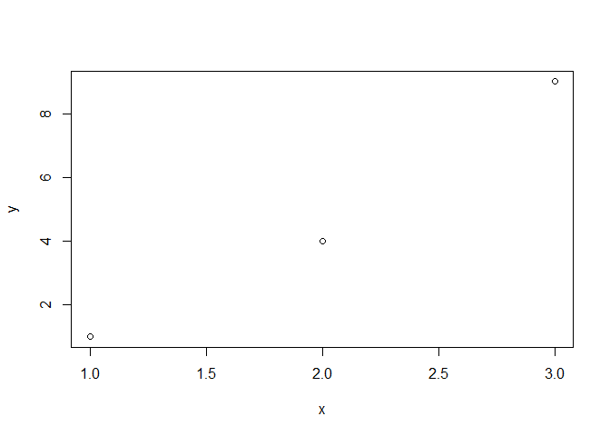
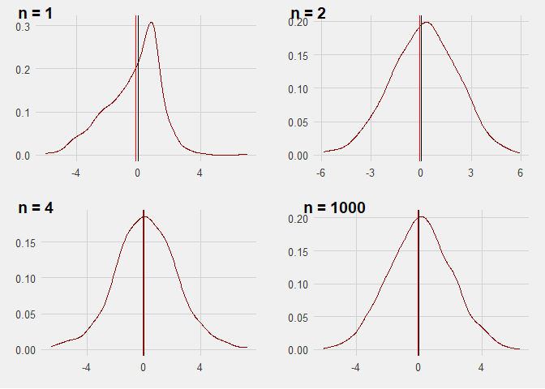
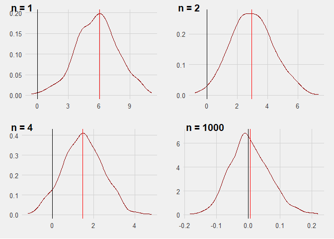

Welcome back! Today, we're going to learn about functions. These notes are in depth to be sure everyone can learn these skills no matter where you are in your understanding.

Let's start our lecture as we always do: load some packages. Packages, as you'll recall, are functions someone has written for R. For us today, we'll be working with...
- ggplot2 to make amazing data visualizations, 
- tidyverse to help manipulate data, 
- magrittr, which helps us tidy up code, and 
 -pacman which makes managing all of these packages so much simpler.

## Lesson 00: Packages


```r
library(pacman)
p_load(tidyverse, magrittr, ggplot2)
```

## Lesson 01: Function Basics

Before we talk about functions in R, we should first make sure we understand what a function is in general. 
You all are probably used to thinking of something like:
  
But what really does this even mean? Why is this a useful tool?
 - It takes some input (a number), and gives us an output (in this case, the squared number, which is indeed also a number). We can represent the function $f$ above as:
  
- `Number -> ADifferentNumber` where that arrow is something we call a mapping. A mapping links one object to another. This doesn't *have* to be two numbers, it could be a word and a dataframe, or two words. For instance, I could come up with a function called `color labeler` and then pass it some object, which it will map to a color.

  `color_labeler(banana) = yellow`

Knowing all of this, we need to go back to lecture 1 to remind ourselves about R-facts before we make a function.

- Everything in R has a `name`, and everything is an `object`
- Functions have `inputs`/`arguments` and `outputs`

With these in mind, let's write a function that will take some x, and spit out x^2 + 10. That is, let's write the code for f(x)=x^2+10.

**Everything in R needs a name** That includes our function.  
We do this by starting with a name, setting it equal to a 'function()' function.

In general, this function looks like `function([some_set_of_arguments]){your function code}`. Let's look at an example below.


```r
#function() is a special operator that takes any arguments you want in the parentheses, and then lets you manipulate
#them in any way you see fit. Think of the parenthese here as the toys you're giving your computer to play with in
#the sandbox.
squarePlusten = function(x){
  
  #tell squarePlusten what to do. x is an input here, we can tell our function to transform our variable into
  #something else.
  
  x_squaredten = x^2+10
  
  #Now, in order to make use of this value, we need our function to spit something out. 
  #We do this with another special function, 'return()'. This will stop your function and tell it to spit out
  #whatever object is in the parentheses. In a sense, it's the toy your computer gives back to the rest of your 
  #workspace.
  
  return(x_squaredten)
}
```

notice however: x_squaredten *isn't equal to anything* now that our function has been run. That's because x_squaredten is only defined in the context of your written function.

Try running this, it won't work


```r
# x_squaredten
```
Now, let's see what our function can do here.


```r
#check for 10. should be 110
squarePlusten(10)
```

```
## [1] 110
```


A couple things to note

 - Brackets around functions lets R know where the function starts and ends. 
 - Technically we do not need them for one line functions

 - Return: this tells the function what it should return for us. We don't hold onto any temporary objects created while your function runs, though the function can modify objects outside of itself.

Remember, functions don't just change numbers to numbers. A more accurate way to think of functions is as a *map* from one object to another. The starting point is the argument, and the end point is the output. The functions take an object as an input 
                                                                                                                      For example, we can write a function that takes a vector, square all the elements, and then return a plot. In this case, (lets call our function g) does the following:
            
`Vector -> Plot`

We're going to need a new tool for this which I will get to.

## Lesson 02: `sapply()`


So, what should our code do?
 - Take a vector, say c(1,2,3)
 - Square each element of the vector. note that we will need a way to store these results. 
Our first step is to figure out all of our moving parts. Here, we need some set of numbers. We can use vectors with the `c()` command!

Lets store them in a vector called x: `x =  c(1,4,9)`
  
Now, I want a function to return a plot with all of the (x,x^2 = y) pairs affiliated. We can use a special function called `sapply()` which lets us perform a function a whole bunch of times.

`sapply()` is cool. This is how it works: `sapply(some_vector,function)` will take every element in the vector and apply your function to it. We can use this to run a function a whole ton of times all at once.


We will use `sapply()`, which takes three arguments, an input, an argument to build a new set of values.


```r
# Build a vector, as we discussed above
x = c(1,4,9)

plot_sq = function(x){  #now we can use the `sapply()` function as discussed above.
  y = sapply(x, function(x) x^2)
  #return the plot
  return(plot(x=x,y=y))
}

plot_sq(1:3)  #check that it works
```

<!-- -->

We just built our own plotting function! Pretty exciting


## Lesson 03: For Loops

Note that we could have also written the same thing with a for loop. What is a for loop?
the definition is actually hinted at in the name: the logical flow here is **'for something `i` in a list/vector, do argument `x`.'** A better source:

From wikipedia:

*A for-loop has two parts: a header specifying the iteration, and a body which is executed once per iteration*

Here is an example of how to write a basic for loop:


```r
x = c()             # Build an empty vector 

for (i in 1:10){    # for object i from 1 to 10
  x[i]= 10/i        # Divide 10 by the numbers 1 through 10.
}

x
```

```
##  [1] 10.000000  5.000000  3.333333  2.500000  2.000000  1.666667  1.428571
##  [8]  1.250000  1.111111  1.000000
```


i is, for each loop, storing the value in your sequence (here, it's a number in `1:10`) then performing the operation you defined in the loop. Like a function, a for loop defines its "body" by setting the start point with a `{` and an end point with a `}` (<-- curly braces).

**Always make sure that you complete your curly braces!! Always makes sure in curly braces, the code is tabbed to the right!**

But, what is this doing? Let's do this manually, but for i in 1:3

For `i = 1`

```r
x_slow = c()        # Start with an empty vector
i = 1
x_slow[i] = 10/i
x_slow
```

```
## [1] 10
```
For `i = 2`

```r
i=i+1
x_slow[i] = 10/i
x_slow
```

```
## [1] 10  5
```

For `i = 3`

```r
i=i+1
x_slow[i] = 10/i
x_slow
```

```
## [1] 10.000000  5.000000  3.333333
```


Really though, we can loop over any object we want. Maybe we want to loop over some weird sequence, say `c(2,300,-4,6)` and the loop will perform some set of operations based on it. For instance,


```r
z = 0

for (i in c(2,300,-4,6)) {
  print(paste0(i, ' plus ', z, ' equals'))
  z = z + i
  print(z)
}
```

```
## [1] "2 plus 0 equals"
## [1] 2
## [1] "300 plus 2 equals"
## [1] 302
## [1] "-4 plus 302 equals"
## [1] 298
## [1] "6 plus 298 equals"
## [1] 304
```


Lets rewrite our function `plot_sq` with a for loop inside it


```r
plot_sqf = function(x){
  y=c()                     # Initialize y
  
  for (i in 1:length(x)) {
  y[i] = x[i]^2             # For each i in the vector i:length, update the ith value in y with:
  }
return(plot(x=x,y=y))       # Return the plot
}

plot_sqf(1:10)              # Plot squared values between 1-10
```

<!-- -->


Understanding the loop
  
`for (i in 1:length(x))`: `i` does what is called "indexing." My goal for this function is to "loop" through all elements of x, and fill a vector called `y` with the squared elements of x. Hence the loop needs to terminate at the final element of `x`. 

 - `length(x)` gives the # of rows x has.
 - `y[i] = x[i]^2` remember how we index arrays in R: row by column. Thus for each i=1,2.., the iterator fills row `i` in `y` with the squared element of the `ith` row of `x`. 

Let's take a look at the plot and make sure it is the same as our last version with `sapply()`


```r
plot_sqf(1:3)
```

<!-- -->


Great! But  that graph looked horrible. How should we spruce it up? Great question, that is something we will talk more about, in great detail, at a later date (see ggplot2).


## Lesson 04: Returning to Heteroskedasticity

You don't have to code this, but I want to give you guys some intuition for part 1f on your problem set. In particular, what does an unbiased & inconsistent vs. biased and consistent estimator look like? Why would we want one or another?

To do this, I'm going to simulate my own data. We're going to build one column of a normal variable. But, we'll be using this functionality a LOT. So let's make a `function` to generate this dataframe.


```r
data_gen <- function(n) {
  return(data.frame(
    v1 = rnorm(n,0,2)
    )
  )
}
```

Now, let's create an *inconsistent but unbiased* estimator.

What exactly does inconsistent mean? What about unbiased? Let's try to estimate the mean of v1

- inconsistent: as N increases, estimator does not necessary converge on true value
- unbiased: E(estimator) = E(estimated)


```r
df <- data_gen(20)
head(df, 10)
```

<div data-pagedtable="false">
  <script data-pagedtable-source type="application/json">
{"columns":[{"label":[""],"name":["_rn_"],"type":[""],"align":["left"]},{"label":["v1"],"name":[1],"type":["dbl"],"align":["right"]}],"data":[{"1":"-3.0202310","_rn_":"1"},{"1":"-3.8340855","_rn_":"2"},{"1":"0.8734738","_rn_":"3"},{"1":"-3.1322236","_rn_":"4"},{"1":"0.8963298","_rn_":"5"},{"1":"3.3779974","_rn_":"6"},{"1":"1.7002259","_rn_":"7"},{"1":"-2.0947341","_rn_":"8"},{"1":"0.3360098","_rn_":"9"},{"1":"1.4260332","_rn_":"10"}],"options":{"columns":{"min":{},"max":[10]},"rows":{"min":[10],"max":[10]},"pages":{}}}
  </script>
</div>

We also are going to generate a lot of these dataframes. Let's make a second function


```r
# First create an empty object - you will see why we need this
est1 = c()

iter <- function(itr, n) {
  for (i in 1:itr) {
    data<-data_gen(n)
    est1[i] = mean(sample(data$v1,1))
  } 
  return(est1)
}
```

This function created an estimator that randomly picks one observation of a variable and uses that to estimate the mean.

Does our estimator fit the bill? Is it unbiased? Not consistent? Let's plot it across several N to get a better idea. We can use ggplot here, but use some of its more advanced functions to do so. Ggplot objects are built in layers, where each layer can be a different section of the graph. We'll also use `cowplot` which lets us build an array of graphs.

Lets load in a cool package: 'ggthemes'


```r
p_load(ggthemes)
```

We will use this package to make sweet graphs using the following code and our generated data.


```r
#n = 1
p1 <- ggplot(,aes(iter(500,1))) +
  geom_density(color = 'darkred') +
  theme_fivethirtyeight() +
  geom_vline(xintercept = 0) +
  geom_vline(xintercept = mean(iter(500,1)), color = 'red')

#n = 2
p2 <- ggplot(,aes(iter(500,2))) +
  geom_density(color = 'darkred') +
  theme_fivethirtyeight() +
  geom_vline(xintercept = 0)+
  geom_vline(xintercept = mean(iter(500,2)), color = 'red')

#n=4
p3 <- ggplot(,aes(iter(500,4))) +
  geom_density(color = 'darkred') +
  theme_fivethirtyeight() +
  geom_vline(xintercept = 0)+
  geom_vline(xintercept = mean(iter(500,4)), color = 'red')

#n = 1000
p4 <- ggplot(,aes(iter(2000,1000))) +
  geom_density(color = 'darkred') +
  theme_fivethirtyeight() +
  geom_vline(xintercept = 0)+
  geom_vline(xintercept = mean(iter(500,1000)), color = 'red')

#let's plot these guys together.
p_load(cowplot)
plot_grid(p1, p2, p3, p4, 
          labels = c("n = 1", "n = 2", "n = 4", 'n = 1000'),
          ncol = 2, nrow = 2)
```

<!-- -->


now, to hurry things along, let's do our other option. Consistent but biased. That means, as n-> infinity, we are converging on beta, but E(estimator) isn't equal to our E(estimated). What kind of function would do that? Well...

 - Here's an example: estimator = mean(data) + 6/n. It will always be biased, but it will converge.
 

```r
est2 = c()
iter2 <- function(itr, n) {
  for (i in 1:itr) {
    data<-data_gen(n)
    est2[i] = mean(data$v1)+6/n
  }
  return(est2)
}
```

Now let's look at this new estimator at different n


```r
#n = 1
p1 <- ggplot(,aes(iter2(500,1))) +
  geom_density(color = 'darkred') +
  theme_fivethirtyeight() +
  geom_vline(xintercept = 0) +
  geom_vline(xintercept = mean(iter2(500,1)), color = 'red')

#n = 2
p2 <- ggplot(,aes(iter2(500,2))) +
  geom_density(color = 'darkred') +
  theme_fivethirtyeight() +
  geom_vline(xintercept = 0)+
  geom_vline(xintercept = mean(iter2(500,2)), color = 'red')

#n=4
p3 <- ggplot(,aes(iter2(500,4))) +
  geom_density(color = 'darkred') +
  theme_fivethirtyeight() +
  geom_vline(xintercept = 0)+
  geom_vline(xintercept = mean(iter2(500,4)), color = 'red')

#n = 1000
p4 <- ggplot(,aes(iter2(500,1000))) +
  geom_density(color = 'darkred') +
  theme_fivethirtyeight() +
  geom_vline(xintercept = 0)+
  geom_vline(xintercept = mean(iter2(500,1000)), color = 'red')

#let's plot these guys together.
library(cowplot)
plot_grid(p1, p2, p3, p4, 
          labels = c("n = 1", "n = 2", "n = 4", 'n = 1000'),
          ncol = 2, nrow = 2)
```

<!-- -->


So, now that you've seen this, which option would you choose? The choice is more complicated than you think, so definitely spend some time on this. The homework question itself is mostly about how much thought you put into your answer, but this question actually has a great deal of value if you see yourself going into data anlaysis in the future.

Note that the `echo = FALSE` parameter was added to the code chunk to prevent printing of the R code that generated the plot.
